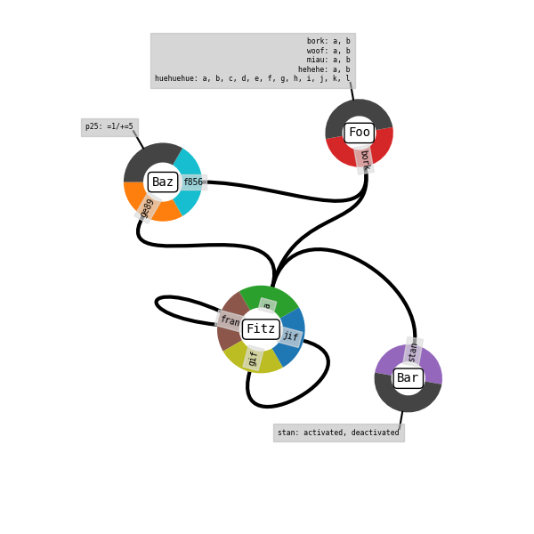

## Classes
All these classes live in the `KaSaAn.core` module.


### KappaSnapshot
This class represents KappaSnapshots. It contains a dictionary, where
the keys are KappaComplexes, and the values are the abundances of those
complexes. The basic methods are re-writings of the core dictionary
methods with more explicit names suitable for Kappa. These serve as
foundation for more advanced methods. Currently, the initializer can
only read from a plain text-file.

Currently implemented methods:
  * `get_snapshot_file_name()`
     * Returns a string with the name of the file this snapshot came from.
  * `get_snapshot_time()`
     * Returns a float with the time at which this snapshot was taken.
  * `get_snapshot_uuid()`
     * Returns a string with the snapshot's UUID.
  * `get_snapshot_event()`
     * Returns an integer with the event number the snapshot was taken at.
  * `get_all_complexes()`
    * Returns a list of KappaComplexes with all the complexes in the snapshot (i.e. one complex per snapshot line).
  * `get_all_abundances()`
    * Returns a list integers with all the abundances in the snapshot.
  * `get_all_sizes()`
    * Returns a list of integers with all the complex sizes visible in the snapshot, one item per complex (i.e. can contain repeat numbers if they correspond to different complexes).
  * `get_all_complexes_and_abundances()`
    * Returns a list of tuples (technically an ItemsView object) of the KappaComplexes and their abundances.
  * `get_total_mass()`
    * Returns an integer with the total mass in the snapshot (i.e. the number of agents).
  * `get_abundance_of_agent()`
    * Returns an integer with the abundance of the given agent. Supports passing a string with the agent expression, or and instance of a KappaAgent. Supports passing agents with signature, e.g. Bob(site{state}).
  * `get_composition()`
    * Return a dictionary where the keys are KappaAgents, their names, and their value is the abundance in the snapshot of those agents. This is akin to the sum-formula used in chemistry.
  * `get_agent_types_present():`
    * Returns a set of KappaAgents, with the names of the agents present in the snapshot (i.e. ignores agent signatures).
  * `get_complexes_with_abundance(query_abundance)`
    * Returns a list of KappaComplexes present at abundance `query_abundance` (integer: number of molecules).
  * `get_complexes_of_size(query_size)`
    * Returns a list of tuples, with KappaComplexes and their abundance, where the complexes are of size `query_size`, an integer being the number of agents.
  * `get_largest_complexes()`
    * Returns a list of tuples with the largest KappaComplexes and their abundance.
  * `get_smallest_complexes()`
    * Returns a list of tuples with the smallest KappaComplexes and their abundance.
  * `get_most_abundant_complexes()`
    * Returns a list of the most abundant KappaComplexes.
  * `get_least_abundant_complexes()`
    * Returns a list of the least abundant KappaComplexes.
  * `get_size_distribution()`
    * Returns a dictionary where the key is the size of a complex and the value is the amount of complexes with that size.
  * `get_all_tokens_and_values()`
    * Returns a dictionary where the key is a KappaToken, and the value the numeric value of the token in this snapshot.
  * `get_value_of_token(query_token)`
    * Returns a float with the numeric value of `query_token`.
  * `get_token_names()`
    * Returns a list of KappaTokens with the tokens present in the snapshot.
  * `get_agent_identifiers()`
    * Returns a list with all the agent identifiers held in the snapshot.
  * `get_complex_of_agent(query_identifier)`
    * Returns the KappaComplex containing the supplied agent identifier. Abundances are not returned as they
        should always be numerically 1; the identifier print-out forces distinction of species that would otherwise
        be identical, and identifiers are unique and stable throughout the simulation.
  * `to_networkx()`
    * Returns a Multigraph representation of the snapshot, abstracting away binding site data. Nodes represent agents, edges their bonds. Nodes have an attribute dictionary where the key `kappa` holds the KappaAgent. Edges have an attribute dictionary where the key `bond id` holds the bond identifier from the complex' Kappa expression; this is not a globally unique identifier at the snapshot level, only at the complex level. Node identifiers are integers, using the order of agent declaration. For a graph `g`, `g.nodes.data()` displays the node identifiers and their corresponding KappaAgents, and `g.edges.data()` displays the edges, using the node identifiers as well as the kappa identifiers.
  * `to_cytoscape_cx()`
    * Export to a structure that via some json encoding and dumping can be read by Cytoscape as a CX file. Usage:
        ```
        my_cx = my_snap.to_cytoscape_cx()
        with open('my_cx.cx', 'w') as out_file:
            json.dump(my_cx, out_file)
      ```
```
>>> from KaSaAn.core import KappaSnapshot
>>> foo = KappaSnapshot('E_10000.ka')
>>> print(foo)
%init: 5 B(s[1]{#}), S(a[.]{#} b[1]{#} m[.]{#} n[.]{#})
%init: 45 B(s[.]{#})
%init: 24 A(s[1]{#}), S(a[1]{#} b[.]{#} m[.]{#} n[.]{#})
%init: 476 A(s[.]{#})
%init: 2 S(a[.]{#} b[.]{#} m[.]{#} n[1]{#}), S(a[.]{#} b[.]{#} m[1]{#} n[.]{#})
%init: 108 S(a[.]{#} b[.]{#} m[.]{#} n[.]{#})
>>> foo.get_size_distribution()
{2: 31, 1: 629}
```


### KappaComplex
This class represents Kappa complexes. Most of the methods return an
instance of KappaAgent.

Currently implemented methods:
  * `get_number_of_bonds()`
    * Returns an integer with the number of bonds present in the complex.
  * `get_size_of_complex()`
    * Returns an integer with the number of agents present in the complex.
  * `get_agent_types()`
    * Returns a set of KappaAgents, with the agent names that make up the complex.
  * `get_all_agents()`
    * Returns a list of KappaAgents, with all the agents that make up the complex (includes agent signature).
  * `get_number_of_embeddings_of_agent(query)`
    * Returns an integer with the number of embeddings a given query `agent(signature)` has on the complex. The query
    must be a KappaAgent, KappaSite, or KappaCounter, or a string that can be parsed into any of those.
  * `get_complex_composition()`
    * Returns a dictionary where the key is an agent name, and the value the number of times that agent appears in this
     complex.
  * `get_agent_identifiers()`
    * Returns a list with the numeric agent identifiers, if any.
  * `to_networkx(identifier_offset: int)`
    * Returns a Multigraph representation of the complex, abstracting away binding site data. Nodes represent
        agents, edges their bonds. Nodes have an attribute dictionary where the key 'kappa' holds the KappaAgent.
        Edges have an attribute dictionary where the key 'bond id' holds the bond identifier from the Kappa expression.
        Node identifiers are integers, using the order of agent declaration. For a graph g, g.nodes.data() displays the
        node identifiers and their corresponding KappaAgents, and g.edges.data() displays the edges, using the node
        identifiers as well as the kappa identifiers. The optional parameter `identifier_offset` will offset all 
        numeric identifiers reported; used in unlabeled snapshots, or when combining graphs
```
>>> bar = foo.get_largest_complexes()[0]
>>> print(bar)
B(s[1]{#}), S(a[.]{#} b[1]{#} m[.]{#} n[.]{#})
>>> bar.get_number_of_embeddings_of_agent('S(b[_])')
1
```
 
  
### KappaAgent
This class represents individual Kappa agents. It supports checking for containment through the `in` keyword. The query
must be a KappaAgent, KappaSite, or KappaCounter, or a string that can be parsed into any of those.

Currently implemented methods:
  * `get_agent_name()`
    * Returns a string with the agent's name.
  * `get_agent_signature()`
    * Return a list of strings with the agent's signature.
  * `get_bond_identifiers()`
    * Returns a list of strings with the bond identifiers that start/end at this agent. For example, for the KappaAgent
    `A(a[.] b[1] c[2] d{a}[.])` these would be the list `['1','2']`.
  * `get_terminus_of_bond(bond)`
    * Returns the name of the KappaSite where a given bond identifier ends.
  * `get_abundance_change_operation()`
    * Returns a string with the agent-level operation performed on this agent; i.e. `+` for creation, `-` for
    degradation, or an empty string for no operation.
  * `get_agent_identifier()`
    * Returns the agent's unique numeric identifier, if any. These are generated in snapshots in the form
         `x[int]:[agent name][agent signature]`
```
>>> baz = bar.get_all_agents()[1]
>>> print(baz)
S(a[.]{#} b[1]{#} m[.]{#} n[.]{#})
>>> 'm[#]' in baz
True
>>> 'n[_]' in baz
False
```

### KappaToken
This class represents Kappa tokens.

Currently implemented methods:
  * `get_token_name()`
    * Returns a string with the name of the token
  * `get_token_operation()`
    * Returns a string with the operation performed on the token (used in rule representation, not in snapshots)
```
>>> tok = KappaToken('ATP')
>>> tok.get_token_name()
'ATP'
```


### KappaPort
This class represents "vanilla" Kappa sites, i.e. sites capable of having internal states and bond states, unlike
counter sites. It supports checking for containment through the `in` keyword. The query
must be a KappaSite, or a string that can be parsed into one.

Currently implemented methods:
  * `get_port_name()`
    * Returns a string with the name of the port.
  * `get_port_int_state()`
    * Returns a string with the internal state of the port, or hash sign (i.e. wildcard) if undeclared.
  * `get_port_bond_state()`
    * Returns a string with the bond identifier of the port, a period if unbound, or a hash sign (i.e. wildcard)
    if undeclared.
  * `get_port_current_bond()`
    * Returns a string with the bond state or identifier required for the rule to fire, or the state or identifier used
    in the non-rule expression.
  * `get_port_future_bond()`
    * Returns a string with the bond state or identifier after rule application, with an empty string for non-rule 
    patterns or usages.
  * `get_port_current_state()`
    * Returns a string with the internal state required for the rule to fire, or the state or identifier
    used in the non-rule expression.
  * `get_port_future_state()`
    * Returns a string with the internal state after rule application, with an empty string for non-rule 
    patterns or usages.
  * `get_port_bond_operation()`
    * Returns the operation being performed on this bond, choice of 'creation', 'deletion', 'swap', 'unknown', or ''.
  * `has_bond_operation()`
    * Returns true if the port has an operation being performed on its bond state.
  * `has_state_operation()`
    * Returns true if the port has an operation being performed on its internal state. 
    
```
>>> fitz = baz.get_agent_signature()[0]
>>> print(fitz)
a[.]{#}
>>> fitz.get_port_int_state()
'#'
>>> 'a[_]' in fitz
False
>>> 'a[#]' in fitz
True
```


### KappaCounter
This class represents counter Kappa "sites", i.e. sites that hold a numeric value in an instance-specific manner, which
can be used as a variable in rule rates (e.g. level of phosphorylation of a protein).

Currently implemented methods:
  * `get_counter_name()`
    * Returns a string with the name of the counter.
  * `get_counter_state()`
    * Returns a string with the counter's value expression, including the delta if specified.
  * `get_counter_tested_value()`
    * Returns a string with the value being tested for the rule's application.
  * `get_counter_delta()`
    * Returns a string with the delta being applied to the counter's value.
  * `has_operation()`
    * Returns true if this counter has an operation being performed on it.
    
```
>>> from KaSaAn.core import KappaCounter
>>> botz = KappaCounter('gorg{>=55/+=39}')
>>> botz.get_counter_name()
'gorg'
>>> botz.get_counter_state()
'>=55/+=39'
>>> botz.has_operation()
True
>>> botz.get_counter_delta()
'+=39'
```


### KappaRule
This class is used to represent rules, specifically those written in Kappa4 Edit notation. It is used mostly for
visualization purposes.

Currently implemented methods:
  * `get_name()`
    * Returns a string with the name of this rule, if named.
  * `get_rate_primary()`
    * Returns a string with the primary (binary in case of ambiguous molecularity) rate for this rule.
  * `get_rate_unary()`
    * Returns a string with the unary rate for this rule, if specified.
  * `get_horizon()`
    * Returns an integer with the molecular horizon specified, if any.
  * `get_agents()`
    * Returns a list with the KappaAgents in this rule, if any.
  * `get_tokens()`
    * Returns a list with the KappaTokens in this rule, if any.
  * `get_bond_identifiers()`
    * Returns a set with the identifiers found in this rule.

```
>>> from KaSaAn.core import KappaRule
>>> foo = KappaRule("'some name' counterfitz(kp{un/ph}[./1]), /*comment with Agent(nasty[.])*/ counterfitz(c1{=3/-=2} kp[./1]) | 55 bob, -55 bob @ 'a' * 'b' / 'c' {'a' / 'b' * 'c'} //comment")
>>> foo
KappaRule("'some name' counterfitz(c1{=3/-=2} kp[./1]{#}), counterfitz(kp[./1]{un/ph}) | 55 bob, -55 bob @ 'a' * 'b' / 'c' { 'a' / 'b' * 'c' } ")
>>> foo.get_name()
"'some name'"
>>> foo.get_agents()[0].get_agent_signature()[0].has_operation()
True
>>> foo.get_agents()[0].get_agent_signature()[0].get_counter_state()
'=3/-=2'
```

### KappaContactMap
This class is used to represent the graph that is a Kappa contact map. In this graph, agent types appear only once, and all their sites binding sites are exposed, presenting all their binding potentials. All data for internal states, including counters, is relegated to an artificial site I call the "flagpole". Sites who have binding data are represented as wedges, making up a doughnut shape that represents an agent. If an agent's site has neither sites with internal state nor counters, it won't appear in the flagpole, and if it hasn't binding data either (i.e. a "dead site"), it won't appear at all.



For a workflow, see the demo script under `models/contact_map/contact_map_demo.py`. On that note, the agent locations and sizes are defined in data coordinates, whereas text is defined in points. To increase the size of text, define a smaller figure; it won't affect agent layout. Also for this reason, the axis is left on after a call to `draw()`, so the user can visualize locations using the same units that would be supplied to the layout methods listed below.

Although the flagpole can't be swapped, the whole agent can be rotated. Thus the recomended workflow is to first rotate the flagpole into position, then swap the binding sites as desired.

Currently implemented methods are:
  * `move_agent_to(agent_name, new_x, new_y)`
    * Change the location of an agent's center by specifying new coordinates. Units are in data-space (as is the axis).
  * `move_agent_by(agent_name, delta_x, delta_y)` 
    * Move the location of an agent's center by some amount. Units are in data-space (as is the axis).
  * `rotate_all_sites_of(agent_name, degrees)`
    * Rotate all the sites on an agent by this many _degrees_.
  * `swap_sites_of(agent_name, site_1, site_2)`
    * Swap the positions of two sites.
  * `set_site_color_of(agent_name, site_name, new_color)`
    * Change the color of a wedge to a new color. Valid options are anything MatPlotLib accepts as a color.
  * `draw(target_axis, draw_state_flag_pole)`
    * Draw the contact map onto the supplied axis. If draw_state_flagpole is True, the flagpole will display all internal state data. If false, only a summary with the number of sites omitted.
