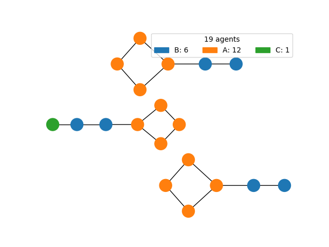
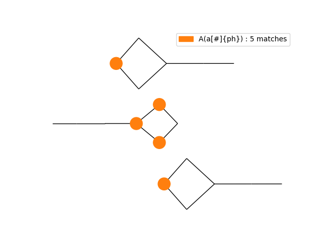
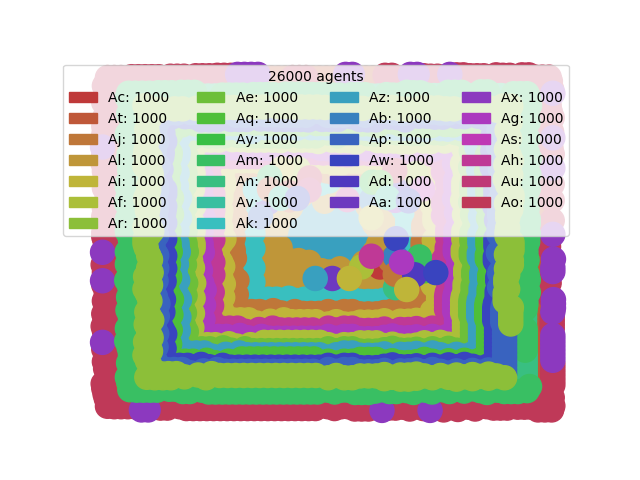
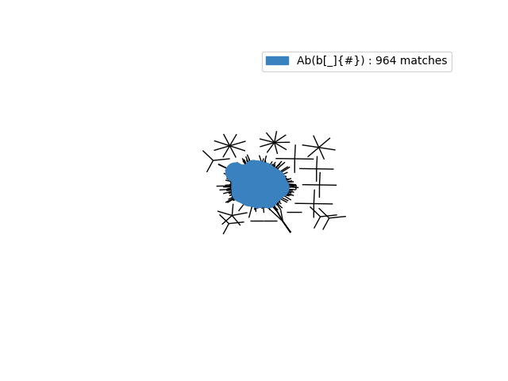
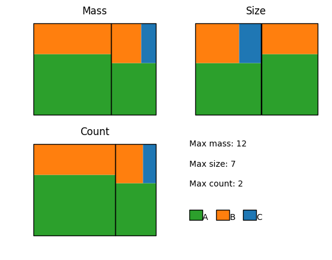
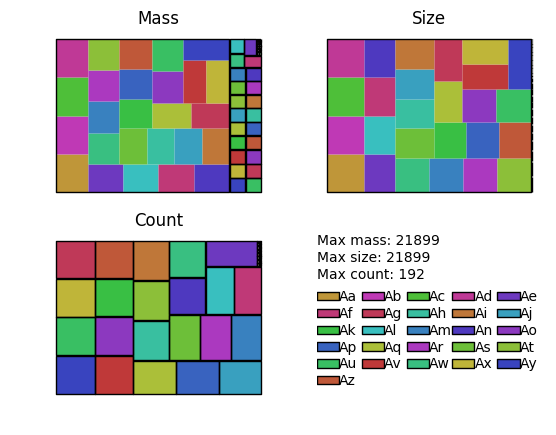

# Command line scripts

Some of these command line scripts are added as entry-points (see `setup.py`, mostly the same name but with `kappa_` prefixed to group by namespace). This is a brief overview of these files. All of them are documented internally, use `--help` for full details. The scripts operate as wrappers that parse arguments, with the functions located under `KaSaAn/functions`.


### `catalytic_potential.py`
Out of a series of snapshots from a simulation, obtain the catalytic potential of each snapshot, and save the list as a CSV file. The catalytic potential of a state, a snapshot, is the sum of the catalytic potentials over all the constituent species. The potential of a species is the product of the number of bound enzyme agents, times the number of bound substrate agents, times the abundance of that species.


### `observable_plotter.py`
Plot a set of observables against time from the observable's file produced by KaSim. The `-d` option toggles "differential" mode, useful for transforming a cumulative token into an instantaneous rate. The `-p` option prints the list of observables to a CSV, where the line number is the index value this script understands. This is useful for models with large number of observables, where plotting a subset is desired. The script also supports calling variables by name, in addition to by index. These can be mixed-and-matched.


### `observable_coplotter.py`
Similar to the `observable_plotter.py` script, but this allows one to plot a single observable from a set of different observable files. When running replicates, it is sometimes useful to coplot the trajectories of key observables in the different simulation outputs. Each observable value will be plotted against its own time definition, so this is resilient against varying time samplings. This script also allows `-d` for "differential" mode.


### `snapshot_visualizer_network.py`
Visualize a kappa snapshot as a plain graph. The script allows one to define a custom coloring scheme for agents; as MatPlotLib understands RGBA tuples, one can set transparency values to show/hide some agents, or focus the view on others. Moreover, the script allows via `-p` a list of kappa patterns; the script will generate a figure with all the nodes colored, and then a figure for each of those patterns, coloring only the agents that match that pattern. This allows multiple views while using a single layout call, which is quite costly for large networks. Moreover, it also allows consistent coloring. The combination of consistent locations and consistent coloring schemes allow one to compare the all-agents snapshot with the pattern-matched one easily.


##### Viewing a simple model
All nodes                               | Nodes that match a pattern
:---------------------------------------|:-----------------------------------------
 | 


##### Viewing a complex model
All nodes                               | Nodes that match a pattern
:------------------------------------------------|:---------------------------------------------
 | 


### `snapshot_visualizer_patchwork.py`
Visualize a kappa snapshot using a patchwork layout, where the area colored is proportional to the metric assayed. Metrics supported are mass (default), size, or count of each molecular species (or all three). Composition of each species is also displayed. While less intuitive, patchwork layouts scale very well for complex states, where traditional network layouts produce unreadable hairballs.


##### Viewing a simple model


##### Viewing a complex model


### `snapshot_visualizer_subcomponent.py`
Visualize an _n_ -mer class from a snapshot as a set of connected graphs. User can request a size class, for example "4", to get a list of all tetramers in the snapshot, and display each as a network, anotated with the copy number of the complex. User can request more than one size class, or leave it blank to request the largest class found. The `-d` option prints to standard output the size distribution found as a dictionary, using `size:abundance`.

### `trace_movie_maker.py`
Make a movie out of a set of snapshot files, and save it to disk. The snapshots are meant to be produced by a trace query (see [TQL](https://github.com/jonathan-laurent/Kappa-TQL)), for example
```
query 'snapshots.csv'
match e every 10 seconds
return snapshot[.e]
```

The produces snapshots can be analyzed and animated into a GIF. For a prozone-like case, this allows one to see where the bulk of the mixture ends up in:


### `graph_largest_complex_composition.py`
Graph the size & composition of the largest complex. Script fill find snapshots in a directory, sort them by their time
 stamp, and perform a stack-plot. Optional parameter allows specification of agents, with or without signature, to be
 plotted, allowing one to filter the resulting plot.