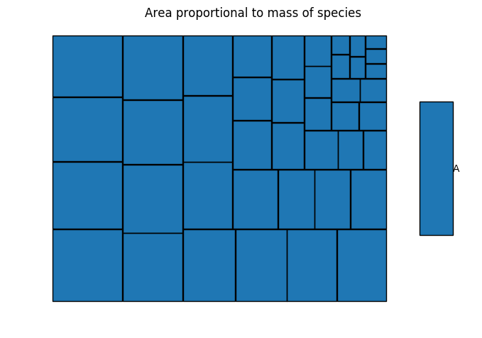
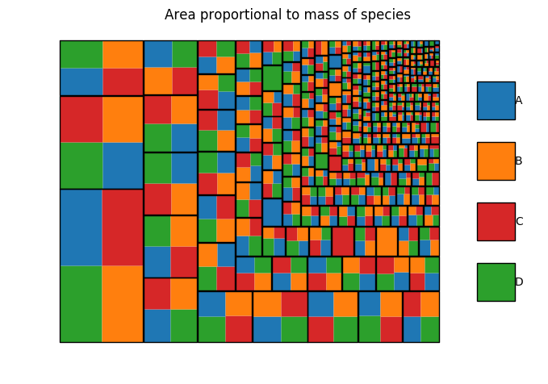

# KaSaAn: Kappa Snapshot Analysis

## Overview
This provides several tools to analyze Kappa snapshots. Concretely, it
implements three classes, and a whole-mix visualizer.

A KappaSnapshot is composed of one or more
entities of KappaComplex, themselves composed of one or more entities of
KappaAgent. Since tokens are not instances of either, there is no
support for tokens: they are ignored.

Several of these methods return objects of the appropriate class. For
example, a KappaSnapshot's `get_largest_complexes()` returns a list of
KappaComplexes. To access the raw string of a complex or agent, use the
`kappa_expression` internal variable. E.g. to get the raw kappa of the
largest complex: `foo.get_largest_complexes()[0].kappa_expression`

This tool is compatible with Kappa syntax 4. An old implementation for
Kappa syntax 3 (i.e. `kappa3_snapshot_analysis.py`) is still available,
though not longer maintained.

## Classes

### KappaSnapshot
This class is a glorified dictionary, where the keys are KappaComplexes,
and the values are the abundances of those complexes. The basic methods
are re-writings of the core dictionary methods with more explicit names
suitable for Kappa. These serve as foundation for more advanced methods.
Currently, the constructor reads from a plain text-file.

Currently implemented methods:
  * `get_snapshot_time()`
     * Returns a float with the time at which this snapshot was taken.
  * `get_snapshot_event()`
     * Returns an integer with the event number the snapshot was taken at.
  * `get_all_complexes()`
    * Returns a list of KappaComplexes with all the complexes in the snapshot (i.e. one complex per snapshot line)
  * `get_all_abundances()`
    * Returns a list integers with all the abundances in the snapshot.
  * `get_all_sizes()`
    * Returns a list of integers with all the complex sizes visible in the snapshot, one item per complex (i.e. can contain repeat numbers if they correspond to different complexes)
  * `get_all_complexes_and_abundances()`
    * Returns a list of tuples of the KappaComplexes and their abundances.
  * `get_total_mass()`
    * Returns an int with the total mass in the snapshot (i.e. the number of agents)
  * `def get_agent_types_present():`
    * Returns a set with the names of the agents present in the snapshot
  * `get_complexes_with_abundance(query_abundance)`
    * Returns a list of KappaComplexes present at abundance `query_abundance`
  * `get_complexes_of_size(query_size)`
    * Returns a list of KappaComplexes of size (in agents) `query_size`
  * `get_largest_complexes()`
    * Returns the largest (or a list of multiple) KappaComplex(es)
  * `get_smallest_complexes()`
    * Returns the smallest (or a list of multiple) KappaComplex(es)
  * `get_most_abundant_complexes()`
    * Returns the KappaComplex (or list of) present at the highest concentration
  * `get_least_abundant_complexes()`
    * Returns the KappaComplex (or list of) present at the lowest concentration (typically 1)
  * `get_size_distribution()`
    * Returns a list of integers with the size distribution of complexes in the snapshot
  * `plot_size_distribution()`
    * Plots the size distribution (i.e. x: length of polymer, y: abundance of that length)
  * `plot_mass_distribution()`
    * Plots the mass distribution (i.e. x: length of polymer, y: abundance * length of that length)
  
### KappaComplex
This class represents Kappa complexes. Most of the methods return an
instance of KappaAgent. To get the raw Kappa expression, access the
instance variable KappaExpression.

Currently implemented methods:
  * `get_number_of_bonds()`
    * Returns an integer with the number of bonds present in the complex
  * `get_size_of_complex()`
    * Returns an integer with the number of agents present in the complex
  * `get_agent_types()`
    * Returns a list of the unique agent names that make up the complex
  * `get_agents()`
    * Returns a list of KappaAgents, with the agents that make up the complex (includes agent signature)
  * `get_number_of_embeddings_of_agent(query)`
    * Returns the number of embeddings a given query `agent(signature)` has on the complex. Single agents only.
  * `get_complex_composition(self)`
    * Returns a dictionary where the key is an agent name, and the value the number of times that agent appears in this complex.
  
### KappaAgent
This class represents individual Kappa agents. To get the raw Kappa
expression, access the instance variable KappaExpression.

Currently implemented methods:
  * `contains_site(query_site)`
    * Returns true if the agent contains `query_site`. It supports state identifiers (e.g. `s~a`) and wild-cards
    (e.g. `s!_`).
  * `get_bond_identifiers()`
    * Returns a list of strings with the bond identifiers that start/end at this agent. For example, for the KappaAgent
    `A(a,b!1,c!2,d~a)` these would be the list `['1','2']`.
  
## Requirements
  * [matplotlib](http://matplotlib.org/)
  

## Examples

### Is there a giant component, and if so what's its composition?
Models `models/linear_polymer.ka` and `models/cyclic_polyvalent_polymers.ka` are different. We can explore one aspect
by looking at their capacity to generate giant components. For the sake of the example, let's assume that a "giant
component" is a complex that takes up at least a tenth of the reaction mixture (i.e. over one out of 10 agents belong to
it). We can analyze snapshots generated by each model to determine what's the difference.

```python
from kappa4_snapshot_analysis import KappaSnapshot

def is_there_a_giant_component(file_name):
    my_snap = KappaSnapshot(file_name)
    my_largest_complexes = my_snap.get_largest_complexes()
    
    # There could be multiple complexes of equal max-size (e.g. multiple types of 135-mers).
    if len(my_largest_complexes) == 1:
        my_giant_component = my_largest_complexes[0]
        
        # If there's one, does it dominate 1/5th the mix?
        if my_giant_component.get_size_of_complex() > my_snap.get_total_mass() / 10:
            print('There is a giant component of size: ' + str(my_giant_component.get_size_of_complex()))
            
            # What's its composition?
            print('It is composed of:')
            my_types = my_giant_component.get_agent_types()
            for i_type in my_types:
                print(i_type + ': ' + str(my_giant_component.get_number_of_embeddings_of_agent(i_type + '()')))
        else:
            print('There is no giant component. Biggest single entity is of size: ' + str(my_giant_component.get_size_of_complex()))
    else:
        print('There are multiple complexes at the maximum size.')
```
Applying this function to `models/linear_polymer_snap.ka` we get:
```
There is no giant component. Biggest single entity is of size: 51
```

Applying it to `models/cyclic_polyvalent_polymers_snap.ka` we get:
```
There is a giant component of size: 1122
It is composed of:
C: 279
A: 279
D: 284
B: 280
```
Worth noting, both snapshots have the same total mass of 10,000.

We can view the composition of both mixtures:
```
$ ./snapshot_visualizer.py -sf ./models/linear_polymer_snap.ka -vm mass -of ./models/linear_polymer_snap_mass.png
```

```
$ ./snapshot_visualizer.py -sf ./models/cyclic_polyvalent_polymers_snap.ka -vm mass -of ./models/cyclic_polyvalent_polymers_snap_mass.png
```


### What is my mixture doing? Is it all aggregating? What's the composition like?

The model alphabet soup contains 28 agents (Aa-Az), with many
dimerization and scaffolding opportunities. We can view the snapshot
(presumed to be taken at steady state) to observe what is the mixture
composition.

#### Count

We sort the molecular species by count (aka frequency, or abundance):
```
$ ./snapshot_visualizer.py -sf ./models/alphabet_soup_snap.ka -vm count -of ./models/alphabet_soup_snap_count.png
```


Each black box represents a species, with the area taken proportional to
the number of times that species is present in the mixture. Here we can
see the mixture is composed of a large set of species at very similar
abundance levels (e.g. a gazillion types of dimers).

#### Size

If we sort the molecular species by size:
```
$ ./snapshot_visualizer.py -sf ./models/alphabet_soup_snap.ka -vm size -of ./models/alphabet_soup_snap_size.png
```


When sorting by size of the species, keep in mind that a single species
is surrounded by a black box. In this image, an enormous species
dominates the view. The next largest species is a very distant second.

#### Mass

If we sort the molecular species by the product of their size times
their abundance:
```
$ ./snapshot_visualizer.py -sf ./models/alphabet_soup_snap.ka -vm mass -of ./models/alphabet_soup_snap_mass.png
```


When sorting by the mass of species, we are asking "what is the bulk of
my mixture doing?". I.e. is my mixture dominated by a very large number
of small species, or a very small number of large species? Here we see
there is a giant component that dominates the bulk of the mixture,
having recruited ~4/5ths of the entire mixture (i.e. its area is ~4/5ths
of the entire patchwork / mixture).