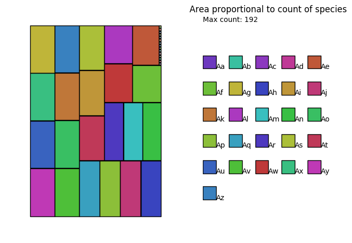
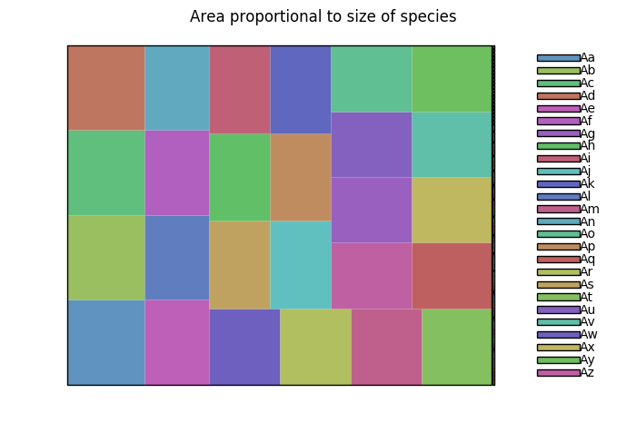
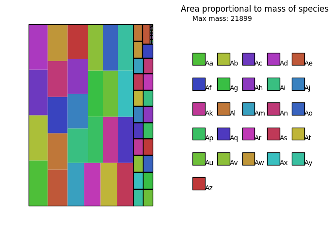
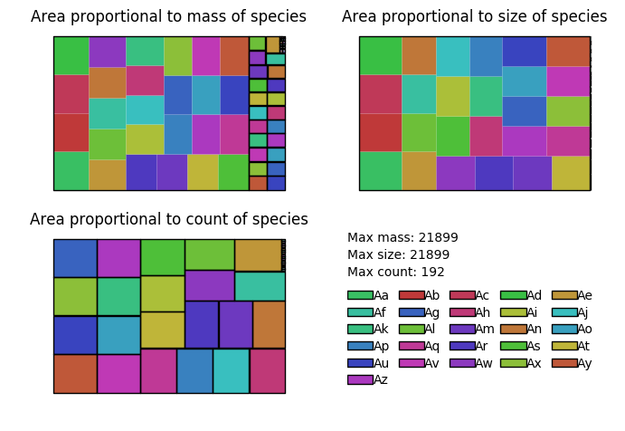

# KaSaAn: Kappa Snapshot Analysis

## Overview
This provides several tools to analyze [Kappa](https://kappalanguage.org/) snapshots. Concretely, it
implements Kappa-centric classes, and a whole-mix visualizer.

Snapshots are represented as instances of the class KappaSnapshot. Within snapshots, molecular species are represented
as instances of the class KappaComplex. Within complexes, proteins/agents are represented as instances of the class
KappaAgent. Within agents, sites are represented as instances of either KappaPort (i.e. sites with internal state and/or
bond state), or KappaCounter (i.e. sites with a numeric value that can be tested and used for dynamic rule rates).
Tokens are represented as instances of the class KappaToken.

In other words, in addition to KappaTokens, a KappaSnapshot is composed of one or more entities of KappaComplex,
themselves composed of one or more entities of KappaAgent, themselves composed of one or more entities of KappaPort
and/or KappaCounter.

Several of these methods return objects of the appropriate class. For example, a KappaSnapshot's
`get_largest_complexes()` returns a list of KappaComplexes. 

This tool is compatible with [KaSim](https://github.com/Kappa-Dev/KaSim/) syntax 4.


## Classes


### KappaSnapshot
This class represents KappaSnapshots. It contains a dictionary, where
the keys are KappaComplexes, and the values are the abundances of those
complexes. The basic methods are re-writings of the core dictionary
methods with more explicit names suitable for Kappa. These serve as
foundation for more advanced methods. Currently, the initializer can
only read from a plain text-file.

Currently implemented methods:
  * `get_snapshot_file_name()`
     * Returns a string with the name of the file this snapshot came from.
  * `get_snapshot_time()`
     * Returns a float with the time at which this snapshot was taken.
  * `get_snapshot_uuid()`
     * Returns a string with the snapshot's UUID.
  * `get_snapshot_event()`
     * Returns an integer with the event number the snapshot was taken at.
  * `get_all_complexes()`
    * Returns a list of KappaComplexes with all the complexes in the snapshot (i.e. one complex per snapshot line).
  * `get_all_abundances()`
    * Returns a list integers with all the abundances in the snapshot.
  * `get_all_sizes()`
    * Returns a list of integers with all the complex sizes visible in the snapshot, one item per complex (i.e. can contain repeat numbers if they correspond to different complexes).
  * `get_all_complexes_and_abundances()`
    * Returns a list of tuples (technically an ItemsView object) of the KappaComplexes and their abundances.
  * `get_total_mass()`
    * Returns an int with the total mass in the snapshot (i.e. the number of agents).
  * `def get_agent_types_present():`
    * Returns a set of KappaAgents of the names of the agents present in the snapshot (i.e. ignores agent signatures).
  * `get_complexes_with_abundance(query_abundance)`
    * Returns a list of KappaComplexes present at abundance `query_abundance` (integer: number of molecules).
  * `get_complexes_of_size(query_size)`
    * Returns a list of KappaComplexes of size `query_size` (integer: number of agents).
  * `get_largest_complexes()`
    * Returns a list of the largest KappaComplexes.
  * `get_smallest_complexes()`
    * Returns a list of the smallest KappaComplexes.
  * `get_most_abundant_complexes()`
    * Returns a list of the most abundant KappaComplexes.
  * `get_least_abundant_complexes()`
    * Returns a list of the least abundant KappaComplexes.
  * `get_size_distribution()`
    * Returns a list of integers with the size distribution of complexes in the snapshot.
  * `get_all_tokens()`
    * Returns a dictionary where the key is a KappaToken, and the value the numeric value of the token in this snapshot.
  * `get_value_of_token(query_token)`
    * Returns a float with the numeric value of `query_token`.
  * `get_tokens_present()`
    * Returns a list of KappaTokens with the tokens present in the snapshot.

```
>>> from KaSaAn import KappaSnapshot
>>> foo = KappaSnapshot('E_10000.ka')
>>> print(foo)
%init: 5 B(s[1]{#}), S(a[.]{#} b[1]{#} m[.]{#} n[.]{#})
%init: 45 B(s[.]{#})
%init: 24 A(s[1]{#}), S(a[1]{#} b[.]{#} m[.]{#} n[.]{#})
%init: 476 A(s[.]{#})
%init: 2 S(a[.]{#} b[.]{#} m[.]{#} n[1]{#}), S(a[.]{#} b[.]{#} m[1]{#} n[.]{#})
%init: 108 S(a[.]{#} b[.]{#} m[.]{#} n[.]{#})
>>> foo.get_size_distribution()
{2: 31, 1: 629}
```


### KappaComplex
This class represents Kappa complexes. Most of the methods return an
instance of KappaAgent.

Currently implemented methods:
  * `get_number_of_bonds()`
    * Returns an integer with the number of bonds present in the complex.
  * `get_size_of_complex()`
    * Returns an integer with the number of agents present in the complex.
  * `get_agent_types()`
    * Returns a set of KappaAgents, with the agent names that make up the complex.
  * `get_all_agents()`
    * Returns a list of KappaAgents, with all the agents that make up the complex (includes agent signature).
  * `get_number_of_embeddings_of_agent(query)`
    * Returns an integer with the number of embeddings a given query `agent(signature)` has on the complex. The query
    must be a KappaAgent, KappaSite, or KappaCounter, or a string that can be parsed into any of those.
  * `get_complex_composition(self)`
    * Returns a dictionary where the key is an agent name, and the value the number of times that agent appears in this
     complex.

```
>>> bar = foo.get_largest_complexes()[0]
>>> print(bar)
B(s[1]{#}), S(a[.]{#} b[1]{#} m[.]{#} n[.]{#})
>>> bar.get_number_of_embeddings_of_agent('S(b[_])')
1
```
 
  
### KappaAgent
This class represents individual Kappa agents. It supports checking for containment through the `in` keyword. The query
must be a KappaAgent, KappaSite, or KappaCounter, or a string that can be parsed into any of those.

Currently implemented methods:
  * `get_agent_name()`
    * Returns a string with the agent's name.
  * `get_agent_signature()`
    * Returns true if the agent contains `query_site`, included is the check against internal and bond states, e.g.
     `my_agent.contains_site_with_states(foo{bar}[.])`
  * `get_bond_identifiers()`
    * Returns a list of strings with the bond identifiers that start/end at this agent. For example, for the KappaAgent
    `A(a[.] b[1] c[2] d{a}[.])` these would be the list `['1','2']`.
  * `get_abundance_change_operation()`
    * Returns a string with the agent-level operation performed on this agent; i.e. `+` for creation, `-` for
    degradation, or an empty string for no operation.
```
>>> baz = bar.get_all_agents()[1]
>>> print(baz)
S(a[.]{#} b[1]{#} m[.]{#} n[.]{#})
>>> 'm[#]' in baz
True
>>> 'n[_]' in baz
False
```

### KappaToken
This class represents Kappa tokens.

Currently implemented methods:
  * `get_token_name()`
    * Returns a string with the name of the token
  * `get_token_operation()`
    * Returns a string with the operation performed on the token (used in rule representation, not in snapshots)
```
>>> tok = KappaToken('ATP')
>>> tok.get_token_name()
'ATP'
```


### KappaPort
This class represents "vanilla" Kappa sites, i.e. sites capable of having internal states and bond states, unlike
counter sites. It supports checking for containment through the `in` keyword. The query
must be a KappaSite, or a string that can be parsed into one.

Currently implemented methods:
  * `get_port_name()`
    * Returns a string with the name of the port.
  * `get_port_int_state()`
    * Returns a string with the internal state of the port, or hash sign (i.e. wildcard) if undeclared.
  * `get_port_bond_state()`
    * Returns a string with the bond identifier of the port, a period if unbound, or a hash sign (i.e. wildcard)
    if undeclared.
  * `get_port_current_bond()`
    * Returns a string with the bond state or identifier required for the rule to fire, or the state or identifier used
    in the non-rule expression.
  * `get_port_future_bond()`
    * Returns a string with the bond state or identifier after rule application, with an empty string for non-rule 
    patterns or usages.
  * `get_port_current_state()`
    * Returns a string with the internal state required for the rule to fire, or the state or identifier
    used in the non-rule expression.
  * `get_port_future_state()`
    * Returns a string with the internal state after rule application, with an empty string for non-rule 
    patterns or usages.
  * `has_bond_operation()`
    * Returns true if the port has an operation being performed on its bond state.
  * `has_state_operation()`
    * Returns true if the port has an operation being performed on its internal state. 
    
```
>>> fitz = baz.get_agent_signature()[0]
>>> print(fitz)
a[.]{#}
>>> fitz.get_port_int_state()
'#'
>>> 'a[_]' in fitz
False
>>> 'a[#]' in fitz
True
```


### KappaCounter
This class represents counter Kappa "sites", i.e. sites that hold a numeric value in an instance-specific manner, which
can be used as a variable in rule rates (e.g. level of phosphorylation of a protein).

Currently implemented methods:
  * `get_counter_name()`
    * Returns a string with the name of the counter.
  * `get_counter_state()`
    * Returns a string with the counter's value expression, including the delta if specified.
  * `get_counter_tested_value()`
    * Returns a string with the value being tested for the rule's application.
  * `get_counter_delta()`
    * Returns a string with the delta being applied to the counter's value.
  * `has_operation()`
    * Returns true if this counter has an operation being performed on it.
    
```
>>> from KaSaAn import KappaCounter
>>> botz = KappaCounter('gorg{>=55/+=39}')
>>> botz.get_counter_name()
'gorg'
>>> botz.get_counter_state()
'>=55/+=39'
>>> botz.has_operation()
True
>>> botz.get_counter_delta()
'+=39'
```


## Visualization
Scripts are provided for visualization of different Kappa entities: snapshots, traces, and rules.


### Snapshot visualization
These scripts use the patchwork / treemap layout. Each molecular species is displayed as a box with a black boundary.
Within each species, its composition is displayed as boxes corresponding to the abundance of agents in that species: an
agent's abundance within that complex is proportional to the area it occupies within the species. All areas are set to
the same scale, so the size of the box of one agent type in one species can be compared to the size of the box of a
different agent type in a different species.
 
Three ways of determining an species's weight are offered: by count (i.e. how many of it there are), by size
(i.e. how many agents it has), and by mass (i.e. the product of the count times the size).

Giant species tend to be rare; tiny species tend to be frequent; when
thinking about the state of the mixture (i.e. "where are my agents?"),
it may be useful to resolve the size vs. rarity trade-off through
their product, hence the `mass` mode is presented.


#### Count
```
$ ./visualization/snapshot_visualizer.py -sf ./models/alphabet_soup_snap.ka -vm count -of ./models/alphabet_soup_snap_count.png
```


Each black-bounded box represents a species, with its area proportional to
the number of times that species is present in the mixture. Here we can
see the mixture is composed of a large set of species at very similar
abundance levels (e.g. a gazillion types of dimers).


#### Size
```
$ ./visualization/snapshot_visualizer.py -sf ./models/alphabet_soup_snap.ka -vm size -of ./models/alphabet_soup_snap_size.png
```


When sorting by size of the species, keep in mind that a single species
is surrounded by a black box. In this image, an enormous species
dominates the view. The next largest species is a very distant second.
There is one type of species that is very large.


#### Mass
```
$ ./visualization/snapshot_visualizer.py -sf ./models/alphabet_soup_snap.ka -vm mass -of ./models/alphabet_soup_snap_mass.png
```


When sorting by the mass of species, we are asking "what is the bulk of
my mixture doing?". I.e. is my mixture dominated by a very large number
of small species, or a very small number of large species? Here we see
there is a giant component that dominates the bulk of the mixture,
having recruited ~4/5ths of the entire mixture (i.e. its area is ~4/5ths
of the entire patchwork / mixture).


#### All
```
$ ./visualization/snapshot_visualizer.py -sf ./models/alphabet_soup_snap.ka -vm all -of ./models/alphabet_soup_snap_all.png
```


It is difficult to view this entity when viewing by `count` alone, as there
is a very low number of copies of it (probably only one). When viewing
by `size`, it however is the only species that is appreciable. When
viewed by `mass`, it is clear it is an important species.


### Traces
One way of visualizing a trace is by making an animated movie of the snapshots through time. Given a trace, the [Trace
Query Language](https://github.com/jonathan-laurent/Kappa-TQL) (TQL) engine can dump snapshots taken at regular time, or
event, intervals.

Let's assume there is a trace `t.json`, and a query, saved as `my_query.txt` (see files under `models/trace_viz`). One
can invoke the TQL engine to read the trace, the query, and save the snapshots as native kappa files
(i.e. ASCII representation, not JSON), saved as `snapshot.0.ka`, `snapshot.1.ka`, etc. (the default naming used by the
 TQL).
```
$ query -t t.json -q my_query.txt --native-snapshots --skip-init-events
```
Then one can produce a movie of the snapshots with:
```
$ ./visualization/trace_movie_maker.py -v -d dir_with_snaps -m mass -o movie.gif
```


In this animation, we can see the prozone effect. Monomers of type B are being pumped into the system at a constant
rate, with the total amount of agents A and C constant at 100 units each. In early times, the mixture is dominated by
the monomeric forms of A and C. As B starts to accumulate, dimers of AB and BC start appearing, with occasional trimers
of ABC. At a point around T=150s, the trimer is the dominant species (in mass). Eventually, however the system is
dominated by monomers of B, around T=250. At later stages, the trimeric ABC is rare compared to the dimers AB and BC,
and the B monomer. Note this visualization is done through the `mass`; it serves to inform "where are the monomers".
The alternative visualizations of `size` or `count` are also informative.

## Requirements
General:
* Python 3.7 or above

For visualization scripts:
* Python packages:
  * numpy
  * matplotlib
  * squarify
* ffmpeg for writing mp4 movies of traces
* imagemagick for writing gifs of traces
* an X server, like Xming under Windows / Windows Subsystem for Linux

On the Kappa Side:
* Kappa Simulator [KaSim](https://github.com/Kappa-Dev/KaSim) v4 or above.
For executing models, producing snapshots, producing traces, etc.

* Trace Query Language engine [TQL](https://github.com/jonathan-laurent/Kappa-TQL).
For querying a trace to, for example, obtain periodic snapshots.


