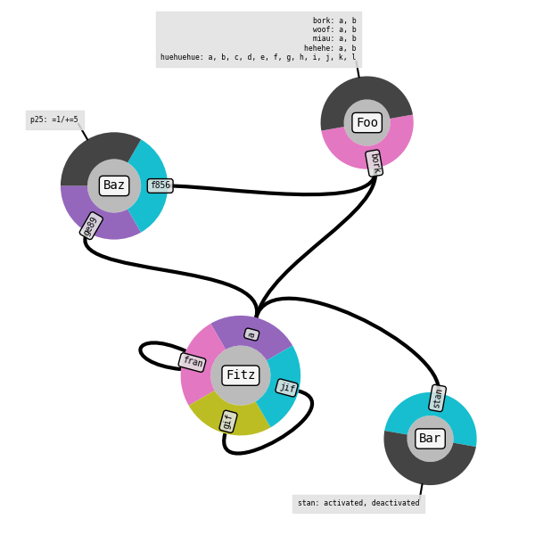

# KaSaAn: Kappa Snapshot Analysis

This provides several tools to analyze [Kappa](https://kappalanguage.org/) snapshots. Concretely, it implements Kappa-centric classes, and some visualizers for snapshots and observables.

Full documentation at https://hmedina.github.io/KaSaAn/KaSaAn/index.html

All nodes                             | Nodes that match a pattern
:-------------------------------------|:-----------------------------------------
 | 


## Overview
Snapshots are represented as instances of the class KappaSnapshot. Within snapshots, molecular species are represented as instances of the class KappaComplex. Within complexes, proteins/agents are represented as instances of the class KappaAgent. Within agents, sites are represented as instances of either KappaPort (i.e. sites with internal state and/or bond state), or KappaCounter (i.e. sites with a numeric value that can be tested and used for dynamic rule rates). Tokens are represented as instances of the class KappaToken.

In other words, in addition to KappaTokens, a KappaSnapshot is composed of one or more entities of KappaComplex, themselves composed of one or more entities of KappaAgent, themselves composed of one or more entities of KappaPort and/or KappaCounter.

Several of these methods return objects of the appropriate class. For example, a KappaSnapshot's `get_largest_complexes()` returns a list of KappaComplexes. 

This tool only compatible with [KaSim](https://github.com/Kappa-Dev/KaSim/) syntax 4 (i.e. latest version as of this writing).

### Classes
For in-depth explanation of the classes and their methods, see readme file in [KaSaAn/KaSaAn/core](https://hmedina.github.io/KaSaAn/KaSaAn/core/index.html)

### Visualization
Some of these command line scripts are added as entry-points (see `setup.py`, mostly the same name but with `kappa_` prefixed to group by namespace). This is a brief overview of these files. All of them are documented internally, use `--help` for full details. The scripts operate as wrappers that parse arguments, with the functions located under `KaSaAn/functions`.


#### Contact maps
For a demo on how to render a contact map, see the demo script `contact_map_demo.py` located under `/models/contact_map/`



Fine grained control is exposed through the various methods of the `KappaContactMap` class. As the layout of these things is not yet automated (if ever...), the user is encouraged to fine-tune with the methods provided. 


## Installation
To install from a freshly downloaded copy, where `[dir]` contains the `setup.py` file:
```
pip install [dir]
```

To install in "development" mode, where the source is linked to and remains editable:
```
pip install -e [dir]
```

### Uninstallation
To uninstall via the standard way:
```
pip uninstall KaSaAn
```

## Requirements
General:
* Python 3.7 or above

For visualization scripts:
* Python packages:
  * `numpy`
  * `matplotlib`
  * `squarify`
  * `networkx`
* `ffmpeg` for writing mp4 movies of traces
* `imagemagick` for writing gifs of traces
* `graphviz` for network layout
* an X server, like VcXsrv under Windows / Windows Subsystem for Linux

On the Kappa Side:
* Kappa Simulator [KaSim](https://github.com/Kappa-Dev/KaSim) v4 or above.
For executing models, producing snapshots, producing traces, etc.

* Trace Query Language engine [TQL](https://github.com/jonathan-laurent/Kappa-TQL).
For querying a trace to, for example, obtain periodic snapshots.


