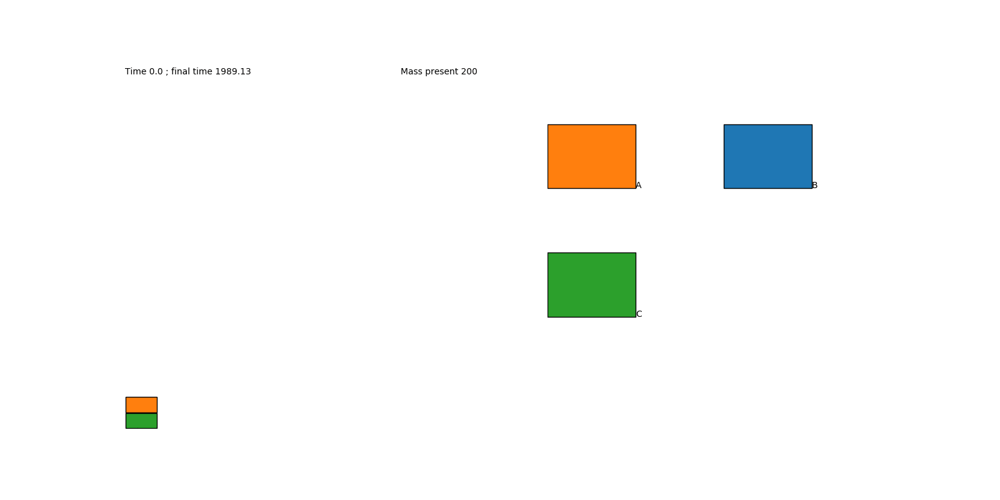

# KaSaAn: Kappa Snapshot Analysis

## Overview
This provides several tools to analyze [Kappa](https://kappalanguage.org/) snapshots. Concretely, it
implements Kappa-centric classes, and a whole-mix visualizer.

Snapshots are represented as instances of the class KappaSnapshot. Within snapshots, molecular species are represented
as instances of the class KappaComplex. Within complexes, proteins/agents are represented as instances of the class
KappaAgent. Within agents, sites are represented as instances of either KappaPort (i.e. sites with internal state and/or
bond state), or KappaCounter (i.e. sites with a numeric value that can be tested and used for dynamic rule rates).
Tokens are represented as instances of the class KappaToken.

In other words, in addition to KappaTokens, a KappaSnapshot is composed of one or more entities of KappaComplex,
themselves composed of one or more entities of KappaAgent, themselves composed of one or more entities of KappaPort
and/or KappaCounter.

Several of these methods return objects of the appropriate class. For example, a KappaSnapshot's
`get_largest_complexes()` returns a list of KappaComplexes. 

This tool is compatible with [KaSim](https://github.com/Kappa-Dev/KaSim/) syntax 4.


## Classes
See readme file in [KaSaAn/KaSaAn/core](./KaSaAn/core/README.md)

## Visualization
Scripts are provided for visualization of different Kappa entities: snapshots, traces, and rules.


### Snapshot visualization
These scripts use the patchwork / treemap layout. Each molecular species is displayed as a box with a black boundary.
Within each species, its composition is displayed as boxes corresponding to the abundance of agents in that species: an
agent's abundance within that complex is proportional to the area it occupies within the species. All areas are set to
the same scale, so the size of the box of one agent type in one species can be compared to the size of the box of a
different agent type in a different species.
 
Three ways of determining an species's weight are offered: by count (i.e. how many of it there are), by size
(i.e. how many agents it has), and by mass (i.e. the product of the count times the size).

Giant species tend to be rare; tiny species tend to be frequent; when
thinking about the state of the mixture (i.e. "where are my agents?"),
it may be useful to resolve the size vs. rarity trade-off through
their product, hence the `mass` mode is presented.


#### Count
```
$ snapshot_visualizer -sf ./models/alphabet_soup_snap.ka -vm count -of ./models/alphabet_soup_snap_count.png
```


Each black-bounded box represents a species, with its area proportional to
the number of times that species is present in the mixture. Here we can
see the mixture is composed of a large set of species at very similar
abundance levels (e.g. a gazillion types of dimers).


#### Size
```
$ snapshot_visualizer -sf ./models/alphabet_soup_snap.ka -vm size -of ./models/alphabet_soup_snap_size.png
```


When sorting by size of the species, keep in mind that a single species
is surrounded by a black box. In this image, an enormous species
dominates the view. The next largest species is a very distant second.
There is one type of species that is very large.


#### Mass
```
$ snapshot_visualizer -sf ./models/alphabet_soup_snap.ka -vm mass -of ./models/alphabet_soup_snap_mass.png
```


When sorting by the mass of species, we are asking "what is the bulk of
my mixture doing?". I.e. is my mixture dominated by a very large number
of small species, or a very small number of large species? Here we see
there is a giant component that dominates the bulk of the mixture,
having recruited ~4/5ths of the entire mixture (i.e. its area is ~4/5ths
of the entire patchwork / mixture).


#### All
```
$ snapshot_visualizer -sf ./models/alphabet_soup_snap.ka -vm all -of ./models/alphabet_soup_snap_all.png
```


It is difficult to view this entity when viewing by `count` alone, as there
is a very low number of copies of it (probably only one). When viewing
by `size`, it however is the only species that is appreciable. When
viewed by `mass`, it is clear it is an important species.


### Traces
One way of visualizing a trace is by making an animated movie of the snapshots through time. Given a trace, the [Trace
Query Language](https://github.com/jonathan-laurent/Kappa-TQL) (TQL) engine can dump snapshots taken at regular time, or
event, intervals.

Let's assume there is a trace `t.json`, and a query, saved as `my_query.txt` (see files under `models/trace_viz`). One
can invoke the TQL engine to read the trace, the query, and save the snapshots as native kappa files
(i.e. ASCII representation, not JSON), saved as `snapshot.0.ka`, `snapshot.1.ka`, etc. (the default naming used by the
 TQL).
```
$ query -t t.json -q my_query.txt --native-snapshots --skip-init-events
```
Then one can produce a movie of the snapshots with:
```
$ trace_movie_maker -v -d dir_with_snaps -m mass -o movie.gif
```



In this animation, we can see the prozone effect. Monomers of type B are being pumped into the system at a constant
rate, with the total amount of agents A and C constant at 100 units each. In early times, the mixture is dominated by
the monomeric forms of A and C. As B starts to accumulate, dimers of AB and BC start appearing, with occasional trimers
of ABC. At a point around T=150s, the trimer is the dominant species (in mass). Eventually, however the system is
dominated by monomers of B, around T=250. At later stages, the trimeric ABC is rare compared to the dimers AB and BC,
and the B monomer. Note this visualization is done through the `mass`; it serves to inform "where are the monomers".
The alternative visualizations of `size` or `count` are also informative.

## Requirements
General:
* Python 3.7 or above

For visualization scripts:
* Python packages:
  * numpy
  * matplotlib
  * squarify
* ffmpeg for writing mp4 movies of traces
* imagemagick for writing gifs of traces
* an X server, like Xming under Windows / Windows Subsystem for Linux

On the Kappa Side:
* Kappa Simulator [KaSim](https://github.com/Kappa-Dev/KaSim) v4 or above.
For executing models, producing snapshots, producing traces, etc.

* Trace Query Language engine [TQL](https://github.com/jonathan-laurent/Kappa-TQL).
For querying a trace to, for example, obtain periodic snapshots.


