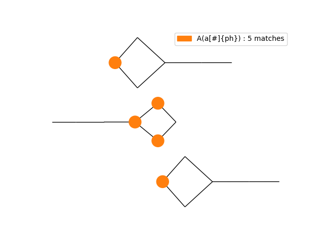

# KaSaAn: Kappa Snapshot Analysis

This project:
* defines Python objects to programatically represent [Kappa](https://kappalanguage.org/) objects (an API)
* provides command-line interface (CLI) scripts for analysis and visualization of the common outputs of the [Kappa Simulator](https://github.com/Kappa-Dev/KappaTools)

Full documentation at https://hmedina.github.io/KaSaAn/KaSaAn/index.html

To make local documentation: `pdoc3 --html --force -o ./docs KaSaAn`

#### Example: render a snapshot as a ball-and-stick network, and label the agents that match a pattern:

All nodes                             | Nodes that match a pattern
:-------------------------------------|:-----------------------------------------
 | 


## API Overview

Full documentation: https://hmedina.github.io/KaSaAn/KaSaAn/core/index.html

Snapshots are represented as instances of the class KappaSnapshot. Within snapshots, molecular species are represented as instances of the class KappaComplex. Within complexes, proteins/agents are represented as instances of the class KappaAgent, whereas bonds are represented as instances of KappaBond. Within agents, sites are represented as instances of either KappaPort (i.e. sites with internal state and/or bond state), or KappaCounter (i.e. sites with a numeric value that can be tested and used for dynamic rule rates). Tokens are represented as instances of the class KappaToken.

In other words, in addition to KappaTokens, a KappaSnapshot is composed of one or more entities of KappaComplex, themselves composed of one or more entities of KappaBond and KappaAgent, the latter composed of one or more entities of KappaPort and/or KappaCounter.

Several of these methods return objects of the appropriate class. For example, a KappaSnapshot's `get_largest_complexes()` returns a list of KappaComplexes. 

This tool only compatible with [KaSim](https://github.com/Kappa-Dev/KaSim/) syntax 4 (i.e. latest version as of this writing).


## CLI scripts

The command line scripts are added as entry-points via Python's setup tools (see `pyproject.toml`; they are all prefixed with  `kappa_`). All of them are documented internally (use `--help` for full details). The scripts operate as wrappers that parse arguments, with the functions located under `KaSaAn/functions`.

### for observables

* `kappa_observable_plotter`: plot the value of an observable, and/or algebraic expressions of observables, as a function of time, from one simulation file; reads observables file (e.g. `data.csv`)
* `kappa_observable_coplotter`: like the above plotter, but plot one expression from mulitiple simulation files (e.g. `r1\data.csv`, `r2\data.csv`, `r3\data.csv`)

### for single snapshots

* `kappa_snapshot_visualizer_patchwork`: render a snapshot as a patchwork diagram
* `kappa_snapshot_visualizer_network`: render a snapshot as a ball-and-stick network
* `kappa_snapshot_visualizer_subcomponent`: render all complexes of a given size from a snapshot as ball-and-stick netoworks

### for collections of snapshots

* `kappa_snapshot_largest_complex_time`: plot the size & composition of the largest complex as a function of time; analyzes snapshots
* `kappa_catalytic_potential`: for each matching snapshot, for each complex, multiply number of agents of one type times the number of agents of another type
* `kappa_trace_movie_maker`: make an animation, rendering snapshots as patchwork diagrams with consistent coloring, of the reaction mixture's evolution

### for contact maps

* `kappa_contact_map`: graph the contact map, as found in the "witness file" (aka `inputs.ka`); supports several algorithms for layout

For a detailed demo on how to render a contact map, see the demo script `/models/contact_map/contact_map_demo.py`


Fine grained control is exposed through the various methods of the `KappaContactMap` class.


## Installation

To install from a freshly downloaded copy, where `[dir]` contains the `pyproject.toml` file:
```
pip install [dir]
```

To install in "development" mode, where the source is linked to and remains editable:
```
pip install -e [dir]
```

### Uninstallation

To uninstall via the standard way:
```
pip uninstall KaSaAn
```

## Requirements

-> See `pyproject.toml`

General:

* Python 3.9 or above

For visualization scripts:

* Python packages:
  * `numpy`
  * `matplotlib`
  * `squarify`
  * `networkx`
* System packages:
  * `ffmpeg` for writing mp4 movies of traces
  * `imagemagick` for writing gifs of traces
  * `graphviz` for network layout
  * an X server, like VcXsrv under Windows / Windows Subsystem for Linux

On the Kappa Side:

* Kappa Simulator [KaSim](https://github.com/Kappa-Dev/KaSim) v4 or above.
For executing models, producing snapshots, producing traces, etc.
* Trace Query Language engine [TQL](https://github.com/jonathan-laurent/Kappa-TQL).
For querying a trace to, for example, obtain periodic snapshots.
